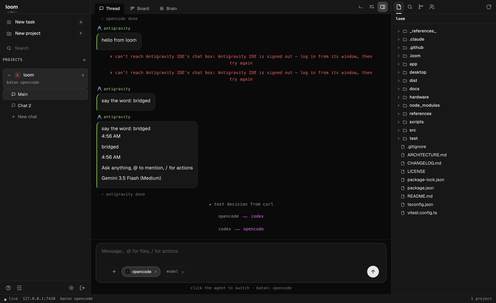
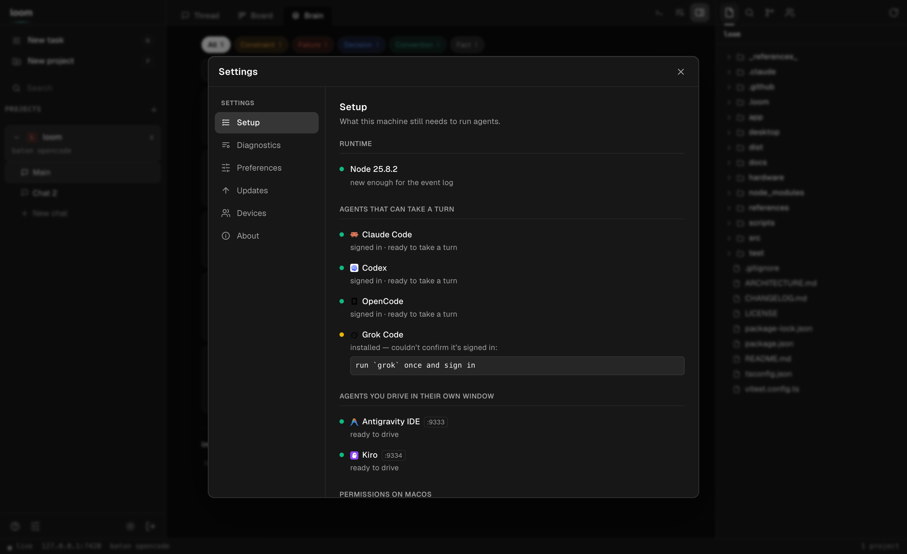
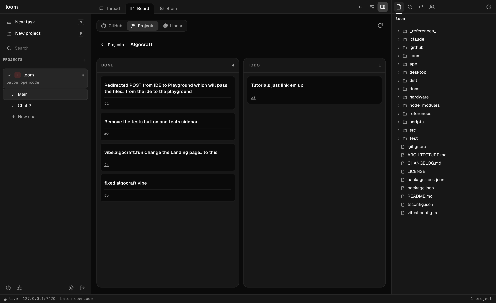
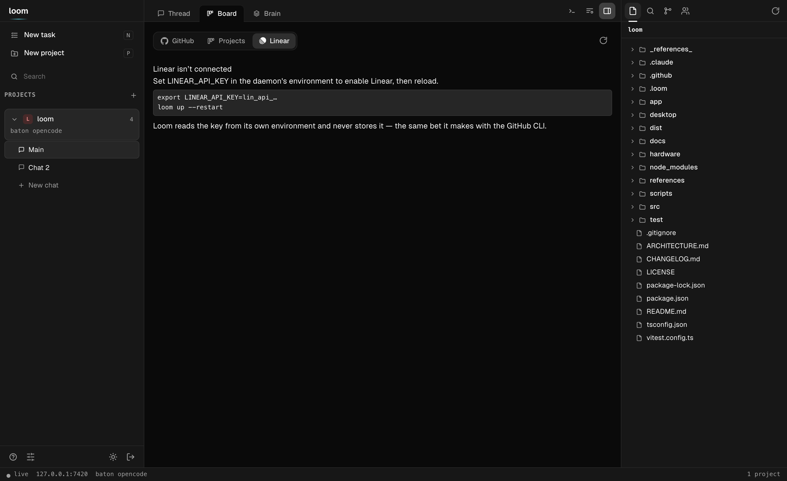
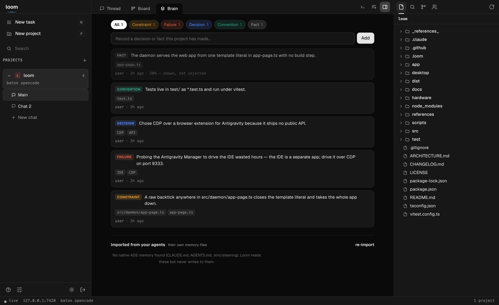

# Loom

[](https://github.com/nickthelegend/loom/actions/workflows/ci.yml)
[](https://www.npmjs.com/package/@loompad/cli)
[](LICENSE)

**The shared-memory layer for AI dev environments.** Every coding agent — Claude Code,
OpenCode, Antigravity, Codex, … — keeps its own brain in its own files. Loom makes them
**one brain**: connect your ADEs, and their memory, decisions, and context become a
single shared thread that flows from one agent to the next.

Today that means **Claude Code, Codex, OpenCode and Grok Code** as full agents, each
verified against a real version, plus **Antigravity and Kiro** driven through their
own windows —
see [Supported agents](#supported-agents) for exactly how far each one goes, and
[How memory actually reaches a model](#how-memory-actually-reaches-a-model) for the
part most tools gloss over.

Loom is **not** another IDE. It's the thin layer *between* your agents — the continuity
and memory they don't share on their own.

```
   CLAUDE.md      AGENTS.md      .antigravity/     ← each ADE's native memory
       │              │               │
       └──────────────┼───────────────┘   import
                      ▼
            ╔═══════════════════╗
            ║  ONE SHARED BRAIN ║   decisions · imported ADE memory · the thread
            ╚═════════╤═════════╝
                      │  projected on every handoff
       ┌──────────────┼───────────────┐
   Claude Code ──▶ OpenCode ──▶ Claude Code      ← baton carries the brain forward
     (plan)        (execute)      (review)
```

<p align="center">
  
  <br>
  <em>One thread over every agent — projects and chats on the left, the shared conversation in the middle, the Explorer on the right, and a composer you switch agents from without leaving the box.</em>
</p>

## Why

Every coding agent keeps its own brain. Claude Code's memory can't be read by
OpenCode; Antigravity doesn't know what you decided with Claude an hour ago. Switch
tools and you re-explain your project every time.

Other multi-agent tools answer this by keeping agents **apart** — each in its own
worktree, run in parallel, compare and merge. Loom makes the opposite bet: keep the
agents' **memory together** so work *continues* across them instead of forking.

- **One brain across every ADE** — Loom imports each agent's native memory
  (`CLAUDE.md`, `AGENTS.md`, …) into a unified store, merges it with your decisions and
  the shared thread, and hands the whole thing to whoever picks up next. `loom memory`.
- **The baton** — exactly one agent works at a time; passing it *carries the context*
  (interrupt-safe, memory projected, briefing armed). Not isolation — continuation.
- **Routes** — let Loom drive the chain: `loom route ship "add dark mode"` runs
  plan → execute → review as one command, the brain flowing hop to hop; or `loom route
  auto` lets an LLM pick each next agent.
- **Every surface, one daemon** — a full-screen TUI, a web app, a desktop window, and a
  phone app (voice input, per-prompt diffs, push) — each a paired client of the same
  local daemon over your tailnet.
- **Local-first & yours** — one `npm i -g`, no account, MIT, runs headless on a server.

## Install

Requires **Node ≥ 22.5** (Loom's event log uses the built-in `node:sqlite`).

```bash
npm install -g @loompad/cli          # → `loom` on your PATH
```

Other paths:

```bash
# one-liner from source (clones ~/.loom-src, builds, links; re-run to update)
curl -fsSL https://raw.githubusercontent.com/nickthelegend/loom/main/scripts/install.sh | bash

# straight from git
npm install -g github:nickthelegend/loom

# hackable checkout
git clone https://github.com/nickthelegend/loom.git && cd loom
npm install && npm run build && npm link
```

Then verify the setup:

```bash
loom doctor        # checks node, agents, tailscale, daemon, and your project
```

Surfaces, all talking to the same daemon:
- **TUI / CLI** — `loom` (default), `loom chat`, `loom send`, …
- **Desktop app** — [`desktop/`](desktop/README.md): `cd desktop && npm install && npm
  start` opens a native Electron window (starts the daemon and pairs itself) on the
  workspace below.
- **Phone app** — [`app/`](app/README.md): `cd app && npx expo install && npx expo start`,
  scan with Expo Go (voice input, per-prompt diffs, push).
- **Web app** — no install; `loom pair` → open the link. Same workspace in the browser.

## The workspace

On a wide screen the web app (and the desktop shell around it) is a full workspace for
*driving* agents — still not an editor: Loom shows you the context and the agents do
the writing.

```
┌───────────┬────────────────────────────┬──────────────┐
│ projects  │  Thread · Board · Brain    │  Explorer    │
│  └ chats  │                            │  Search      │
│           │  the conversation, with    │  Source ctl  │
│ New task  │  Update(n files) cards ────┼─▶ diff opens │
│ New proj  │                            │  Agents      │
│ Search    ├────────────────────────────┤              │
│           │  terminal (a real shell)   │              │
└───────────┴────────────────────────────┴──────────────┘
  live · host · baton · spend                    ← status bar
```

- **Projects + chats** in the left rail: a project holds as many conversations as you
  want, and they share one brain, one baton and one working tree. The **agents** live in
  the right panel — click one to aim your next message at it, click its role to rename
  the job (roles are free text: "architect", "the one that writes docs", anything).
- **Thread** is the shared conversation; **Brain** is the unified memory; **Board**
  is everything in flight.
- **Board** is one board with three sources — **GitHub**, **Projects**, **Linear** —
  switched from a segmented control (see [GitHub & Linear, native](#github--linear-native)).
  GitHub is four live columns (working → needs you → in review → ready to merge); cards
  come from **yours** (`+ Task`), **Loom** (which agents are running or blocked), and
  your repo's **PRs** (draft, CI failed, changes requested, approved — read through your
  own `gh`). Search issues and PRs in GitHub's own query language; **Start** hands an
  issue to an agent. Dragging your own card really moves it; dragging a PR card only moves
  where you *see* it — the badge keeps telling the truth, because a drag can't approve a
  review or turn CI green. Each card wears its agent's own logo.
- **Click any change** — an `Update(n files)` card, or a file in Source Control — and the
  diff opens to the right of the chat. It stays closed until you ask for it.
- **Explorer / Search / Source Control / Tasks** in the right panel; every column is
  drag-resizable (double-click a handle to reset).
- **Terminal** (`Ctrl` + `` ` ``) is a real terminal in the project directory — a
  proper pty, so the shell draws its own prompt and `vim`, `less`, `htop`, `^C`
  and `^Z` all behave. `node-pty` is optional: without it (Linux with no build
  toolchain) you get a pipe-backed shell instead, where `cd` and variables still
  persist and `^C` still works, driven a line at a time.
- **New task** (`n`) picks a project, a task, and **one agent — or several**, which run
  it as a pipeline, hop to hop. **New project** (`p`) adds a repo — a native folder
  picker in the desktop app — and reports which ADEs it found on the host.

### Settings, in one place

Everything about a Loom lives behind the gear in the bottom-left: **Setup** (what the
machine still needs to run agents), **Diagnostics** (`loom doctor`, run live on the
daemon), **Updates** (build rev, and how far the checkout is behind its remote),
**Preferences** (theme, the brain extractor, handoff brief style, default agent),
**Devices** (paired clients — revoke one, or pair another), and **About**.

<p align="center">
  
</p>

## GitHub & Linear, native

Browse pull requests, issues, and **GitHub Project boards** in-app; open a worktree from
any task; review and approve PRs; and file **Linear** issues with a team selector — no
context switch, no second browser tab.

<p align="center">
  
  <br>
  <em>A GitHub Project (v2) board, in-app — items grouped by their Status column, each linking back to its issue or PR.</em>
</p>

- **Browse PRs, issues, and Project boards.** The **GitHub** source is the live kanban;
  the **Projects** source lists the owner's GitHub Project (v2) boards and lays a
  project's items out by Status; search takes github.com's own query language.
- **Review and approve PRs in place.** Open a PR's diff without leaving Loom and post the
  three things a reviewer does — **comment**, **request changes**, **approve**. The review
  is signed as you (through your `gh`); approve asks first, because it publishes.
- **Open a worktree from any task.** One click cuts a checked-out branch in its own
  directory, a sibling of the repo: a **PR** worktree checks the branch out — forks
  included — and an **issue** worktree cuts a fresh branch to start it. An agent can work
  a PR while your main tree stays exactly where you left it.
- **Create Linear issues with a team selector.** Pick a team, write a title and
  description, file it — the new issue's identifier comes straight back.

<p align="center">
  
  <br>
  <em>Linear is off until you connect it — and Loom tells you exactly how, because it holds no token of its own.</em>
</p>

**Loom holds no token of its own.** GitHub goes through your `gh` CLI; Linear reads
`LINEAR_API_KEY` from the daemon's own environment (you `export` it) and never stores,
logs, or transmits it anywhere else. No key → an honest "not connected", never a dead
form — the same bet the agent adapters make by shelling out to the CLIs you already have.

## Quickstart

```bash
cd your-project
loom init          # detects installed agents (claude, opencode), assigns roles
loom               # opens the TUI — a tabbed workspace (Thread · Board · Brain · Diff)
```

```
  ██      ▄████▄  ▄████▄  ▄█▄▄█▄
  ██      ██  ██  ██  ██  ██▀▀██
  ██      ██  ██  ██  ██  ██  ██
  ██████  ▀████▀  ▀████▀  ██  ██
        one thread · every agent

  1 Thread   2 Board   3 Brain   4 Diff                          ↑12  pgup/pgdn
  10:44 claude-code  here's the plan: …
   ⟶ baton: claude-code → opencode
  10:45 opencode     implementing step 1 …

 ╭──────────────────────────────────────────────╮
 │ › Ask anything… "/route ship: add dark mode" │
 │ opencode · executor ⟵ baton                  │
 ╰──────────────────────────────────────────────╯
   shift+tab view · tab agent · ctrl+p palette · esc back/interrupt
   ~ my-project · baton opencode  ➤ ship 2/3
```

The TUI is a **tabbed workspace**, not just a thread:

- **Thread** — the conversation, streamed. **`tab` shifts the active agent/IDE**
  (claude-code → opencode → back); the handoff (interrupt-safe, memory projected, briefing
  armed) happens when you hit enter, so switching is one keystroke, not a ceremony.
- **Board** — agents, your cards, issues and PRs in the four flow columns.
- **Brain** — the memory the project has learned, grouped by kind (failures first), each
  tagged with who learned it.
- **Diff** — the working tree: changed files and a colourised patch.

**`shift+tab` cycles the tabs** (or `/board`, `/brain`, `/diff`, `/thread`, or the
palette); `pgup/pgdn` scrolls the view. **`ctrl+p` opens the command palette**
(fuzzy-filtered: jump to a view, shift to any agent, launch a named route, decision,
interrupt, pair…). `esc` steps back to the thread or interrupts the running turn; `/help`
lists the slash commands.

Prefer plain line-mode (SSH, scripts)? `loom chat` is the same thread as a classic REPL,
and every action also exists as a one-shot command (`loom send`, `loom handoff`, …).

## Routing — multi-hop pipelines

Handoffs are unlimited and manual by default. **Routes** automate a chain of them:

```bash
loom route auto "add a dark-mode toggle"          # DYNAMIC: an LLM picks each hop
loom route ship "add a dark-mode toggle"          # named pipeline from config
loom route planner,executor "fix the flaky test"  # ad-hoc: roles…
loom route claude-code,opencode,claude-code "…"   # …or agent ids, any length
```

**`auto` is dynamic routing**: after every hop, a router looks at the task, the hop
history, and the last replies, then picks the next agent — or declares the task done.
The router is Claude (headless, small model, JSON out) with a deterministic
plan→execute→review rules engine as automatic fallback, so routes never stall on a
router failure. Every decision is logged with its reason
(`➤ hop 2 → opencode (plan ready — execute it)`), a hop budget caps runaways
(`--max-hops`, default 8), and `--router rules` skips the LLM entirely.

What happens per hop: interrupt-safe **handoff** → shared-memory **projection** →
**briefing** → the step's role instruction. Then:

- step finishes cleanly → Loom advances to the next agent automatically;
- the agent asks a question → the route **pauses** (`waiting_human`), you get a
  notification, `loom route --status` and the board show the question; you answer in
  the shared thread (`loom send "…"`) and the route **resumes by itself**;
- an agent errors or a step times out (45 min default) → the route fails loudly;
- **you always outrank the route**: any manual `handoff`/`interrupt` cancels it, and
  `loom route --abort` stops it and interrupts the in-flight turn.

`--detach` returns immediately (fire-and-notify); following with Ctrl-C also leaves the
route running server-side. One route per project at a time (the baton is one write
lock); run routes across *different* projects in parallel freely.

Define named pipelines in `.loom/config.json` — steps are roles or agent ids, and any
step can carry its own focus:

```json
"routes": {
  "ship": ["planner", "executor", "reviewer"],
  "api-only": [
    { "step": "planner",  "instruction": "design the endpoint contract only" },
    { "step": "executor", "instruction": "only touch src/api — no schema changes" },
    "reviewer"
  ]
}
```

Per-step instructions are appended to the role guidance for exactly that step — the
next hop never sees them. `loom init` seeds a `ship` route automatically when it
detects at least two roles.

## Commands

| Command | What it does |
|---|---|
| `loom` | **The TUI** — tabbed workspace (Thread · Board · Brain · Diff), `shift+tab` switches view, `tab` shifts agents, `/`-commands + `ctrl+p` palette inline |
| `loom init` | Make the current directory a Loom project (auto-detects agents) |
| `loom chat` | Same thread as a plain line REPL (`/handoff`, `/interrupt`, `@agent`) |
| `loom send <text>` | One-shot message (`-a <agent>` to address someone specific) |
| `loom handoff <agent>` | Pass the baton — interrupts, projects memory, briefs the target |
| `loom route <spec> "<task>"` | Run a pipeline (name, or `a,b,c` ids/roles); `--status` / `--abort` / `--detach` |
| `loom routes` | List named pipelines defined for this project |
| `loom interrupt` | Stop the current holder's turn (cancels an active route) |
| `loom decision <text>` | Record a decision into shared memory |
| `loom memory [import]` | The unified brain — one memory across every connected ADE |
| `loom log [-f]` | Show (or follow) the project event log |
| `loom costs` | Project spend: total + per-agent turns, $ and agent time |
| `loom agents` / `loom projects` / `loom status` | Who's who, board of projects, daemon health |
| `loom up [--tailnet] [--restart]` / `loom down` / `loom daemon` | Daemon lifecycle (`--tailnet` binds to your Tailscale IP) |
| `loom pair` | QR deep link that pairs a phone (single-use token) |
| `loom clients [--revoke <id>] [--ping]` | Paired devices: list, revoke, or send a test push |
| `loom doctor` | Diagnose env, daemon, binding, and project config — with fixes |

## Supported agents

| Agent | Tier | Transport | Status |
|---|---|---|---|
| Claude Code | adapter (full-duplex) | headless CLI, `stream-json`, `--resume`, briefing via `--append-system-prompt` | ✅ verified against 2.1.83 |
| Codex | adapter (full-duplex) | `codex exec --json` (JSONL), `exec resume <thread>`; found on PATH **or inside Codex.app** | ✅ verified against codex-cli 0.142.4 |
| OpenCode | adapter (full-duplex) | `opencode serve` HTTP + SSE (`/prompt`, `/interrupt`, `/event`) | ✅ verified against 1.17.20 |
| Grok Code | adapter (full-duplex) | `grok -p --output-format json`, `-r <session>` | 🔶 verified against 0.2.54 — **answers only, no tool or edit events** (see below) |
| Echo | adapter (demo/tests) | in-process | ✅ |
| Antigravity | **bridge** (driveable) | Chromium debug port — types into the real chat panel and reads the panel back | 🔶 mechanism verified; its selectors are not (see below) |
| Kiro | **bridge** (driveable) | same, via the same driver | 🔶 mechanism verified; its selectors are not |

Three of those need their asterisks spelled out, because the table row is
shorter than the truth:

**Codex reports tokens, never money.** Its `turn.completed` carries
`input_tokens` / `output_tokens` and no dollar figure, so Loom shows tokens and
no cost for Codex turns. A USD number derived from a price table we'd have to
keep current is fiction with a decimal point in it.

**Grok can't show you its steps.** `--output-format streaming-json` sounds like
it would help and doesn't: it emits `thought` and `text` deltas and a final
`end`, with no tool calls and no file edits — not even when the turn
demonstrably ran a shell command and wrote a file. So a Grok turn in the thread
is what it said, and `git status` is what it did. Inferring the edits by diffing
the tree would put guesses in the event log dressed as facts. Its permission
mode also defaults to `bypassPermissions`, because headless with no TTY to ask,
every other mode ends the turn `Cancelled` having written nothing.

**Antigravity and Kiro are driven, not routed.** Both are Electron apps with no
API; Loom connects to the debugging port, finds the chat box, types through the
input pipeline and reads back what the panel gained — the approach
[antigravity_phone_chat](https://github.com/krishnakanthb13/antigravity_phone_chat)
takes, and for the same reason: never touch the provider APIs, drive the app
that's already signed in. Launch them with
`--remote-debugging-port=9222` first.

The driver refuses more than it accepts, on purpose. Both apps are VS Code
family and Monaco — the editor holding your source file — is a
`contenteditable`. Anything under `.monaco-editor` is never a candidate, a
candidate must be labelled like a chat box, and zero-or-several matches is a
refusal that names the fix (`options.selectors.composer`). Typing a prompt into
your code and pressing Enter is not a mistake an error message repairs.

What's verified is the mechanism, against a real Chromium. What is **not**
verified is either app's actual chat DOM: Antigravity shows a sign-in screen and
Kiro shows no chat panel until you open one, so there was no composer to read
the selectors from. Reachable and driveable are separate questions, and Loom
answers both — a signed-out Antigravity replies to CDP cheerfully and reports
`driveable: false — no chat box on screen`.

**Adapters** implement the full contract (send / stream / injectMemory / interrupt /
diff) and may hold the baton. **Bridges** only observe and receive shared-memory
projections — they never hold the write lock. That's a design decision, not a gap: GUI
agents without a stable API can't be trusted with interrupt-safe writes. See
[docs/integration-notes.md](docs/integration-notes.md) for the verified surfaces.

## How memory actually reaches a model

Worth being precise about, because this is the whole premise and it has a soft edge.

Loom **reliably builds** the shared brain (every ADE's imported memory + your decisions
+ the thread) and **reliably writes** it to `.loom/memory/<agent>.md` on every handoff.
That part is solid and tested.

Getting it into the model's context is a different problem, and it depends on the agent:

| Agent | How the brain arrives | Strength |
|---|---|---|
| Claude Code | briefing via `--append-system-prompt` — the model *always* sees a summary (recent decisions + messages) plus a pointer to `.loom/memory/claude-code.md`, which it can Read | **strong** — the summary is guaranteed; the full file is one tool-call away |
| Grok Code | the briefing rides in `--rules`, Grok's real system-prompt channel, so `-p` stays your clean prompt | **strong** — `--rules` is a genuine system channel, not text in the turn |
| Codex | no `--append-system-prompt` on `codex exec`, so the briefing rides in front of your prompt — **framed** as an unmissable `LOOM SESSION MEMORY — authoritative, read first` block | **reliable** — one prompt either way, but framed so it can't be mistaken for chatter |
| OpenCode | no per-prompt system field on `/prompt`, so the same **framed** block is prepended to your prompt | **reliable** — delivered as an authoritative block, not loose text |
| Antigravity, Kiro | nothing tells them the file exists — Loom types into their chat box, which is not a system prompt | **none** — a human has to open it |

So: the **summary always lands**; the **full brain is an invitation**. An agent that
ignores the pointer works from the summary alone. If you need something remembered for
certain, put it in a decision (`loom decide`) — decisions ride in the briefing itself.
There's an opt-in eval (`LOOM_TEST_REAL=1`) that checks a real model actually *uses* an
injected brief, and declines rather than invents when the brief is silent.

Memory also flows **one way**. Loom reads `CLAUDE.md` / `AGENTS.md` and never writes
them, so your ADE's own memory files stay yours. And the import is a **merge, not a
parse**: files are read, capped at 8000 chars, and concatenated under headers. Claude
Code's `@path` imports are **not followed** — a `CLAUDE.md` that is mostly `@` pointers
imports the pointers, not what they point at.

The brain also **learns on its own**. After each turn a small Claude reads what changed
and files what's worth keeping as typed memory *units* — a constraint, a decision, a
convention, a fact, a failure — reconciled on write (add / update / forget, never a
growing blob), the approach [mem0](https://github.com/mem0ai/mem0) pioneered, adapted to
Loom's event log. Every unit's evidence is verified against the turn before it's kept, so
the brain doesn't remember things that were never said. Retrieval is hybrid too — exact
entity matches (file paths, symbols, error codes) unioned with BM25 over the text, no
embedding model to ship — with failures and constraints biased to the top of the brief,
because getting burned twice is worse than missing a detail.

The brain is the **project's**, not each agent's: a fact one agent learns is scoped to the
chat, not walled off to whoever happened to learn it, so it reaches whichever agent takes
the baton next. (The [`brain-shared` test](test/brain-shared.test.ts) makes this concrete —
five agents each learn one fact, and every other agent's brief then carries all five.) The
**Brain tab** — and `loom tui`'s **Brain** view — show exactly what it has learned; toggle
the extractor off per project in Settings.

<p align="center">
  
  <br>
  <em>The Brain tab — learned memory units, grouped by kind, each traceable to the turn it came from.</em>
</p>

## How it works

- **Event log** (`.loom/log.db`, SQLite via `node:sqlite`, JSONL fallback) — every
  message, tool call, file edit, decision, and handoff, appended in order. The log *is*
  the project's memory; everything else is a view of it.
- **Projection** — on handoff, Loom distills the log into
  `.loom/memory/<agent>.md` (persistent, namespaced) and arms a short one-shot briefing
  injected with the target's next turn (system-prompt append for Claude Code, delimited
  preamble for OpenCode). Two renderers behind one interface:
  - **template** (default) — deterministic, instant, free;
  - **llm** — a small Claude model distills the recent log into a dense doc
    (mission / current state / decisions / risks / next moves). Opt in per project:
    `"projection": { "mode": "llm", "model": "haiku" }`. Any failure or timeout falls
    back to the template — a broken Claude never blocks a handoff. Bridges always get
    template views (no N×LLM waste per hop).
- **Baton** — persisted per project (`.loom/state.json`). Messages route to the holder;
  addressing a non-holder returns `409 not_holder` and the surface asks you to confirm a
  handoff. Ghost holders (agent removed from config) self-heal. Every handoff snapshots
  the outgoing agent's working-tree state (dirty flag + `git status`) into the log.
- **Unified memory ("multiple memory in one")** — each connected ADE keeps its own
  native memory (`CLAUDE.md`, `AGENTS.md`, …). Loom imports them all into one brain
  (`memory_import` events, content-hash deduped), merges them with the project's
  decisions and shared thread, and projects the union into whoever holds the baton.
  Connect a new agent → its knowledge joins the brain, and everything the others learned
  flows into it. `loom memory` shows the merged brain; it refreshes on open and on every
  handoff. This is the seam an isolation-first tool (separate worktrees) can't own.
- **Decisions** — `loom decision <text>` pins a fact, and any agent line starting
  `Decision: …` is captured automatically. Decisions ride every future projection.
- **Cost telemetry** — agents that report per-turn cost (Claude Code, OpenCode) feed a
  live ledger: `loom costs` breaks it down per agent, the board/TUI/phone app show the
  project total, and every route logs exactly what it spent
  (`✔ route completed (3 steps) · $0.0421`). Totals rehydrate from the event log, so
  they survive restarts.
- **Daemon** — one process, many projects. REST for commands, WebSocket for the live
  stream. Config edits hot-reload when the project is quiet.

## Your phone (Android today, over Tailscale)

The daemon serves a full phone app at `/app` — board, live thread, agent chips, routes.
No app store, no build step; it ships inside Loom.

**Pair from the app.** The web/desktop window has a **Connect a phone** button next to the
terminal: it opens a modal with a QR (and a copy link) and a **Local network / Tailnet**
toggle. Pick one and, if the daemon is still localhost-only, hit **Enable phone access** —
Loom adds a *second listener* on that LAN or tailnet IP (localhost is never disturbed, so
the window you're in doesn't blink) and shows a QR your phone can actually reach. Same
single-use token, no terminal needed.

**Or pair from the terminal:**

```bash
loom up --tailnet     # daemon binds to your Tailscale IP (never 0.0.0.0)
loom pair             # QR appears in the terminal (also `/pair` inside `loom tui`)
```

Scan the QR with your phone camera (for the tailnet path, the phone must be on your
tailnet — install the Tailscale app and sign in; the local-network path just needs the
same Wi-Fi). The link opens `…/app#pair=<token>`; the app claims the **single-use,
10-minute** pairing token from the URL fragment (fragments never hit the network log) and
exchanges it for its own client token. Then:

- **Board** — every project, needs-input dots, baton holder, live route progress.
- **Thread** — the same shared conversation, streaming over WebSocket.
- **Agent chips** — tap `opencode`, hit send: baton shifts (projection + briefing
  included), exactly like `tab` in the TUI.
- **Routes** — the ➤ button opens a picker: choose **auto** (LLM picks each hop), any
  named pipeline, or custom steps, type the task, go. Live banner with hop progress and
  reasons, an abort button, and when a route pauses on a question you answer right
  there and it resumes.
- Chrome menu → *Add to Home screen* installs it like an app.

**Push notifications** come with the native app ([`app/`](app/README.md)): open it once
after pairing and it registers its Expo push token with the daemon. From then on your
phone buzzes when an agent **needs input**, when a **route completes or fails**, and
when a solo turn finishes — route hops are deliberately silent (a 5-step pipeline
buzzes once, not five times). Verify with `loom clients --ping`.

## Security model

- The daemon binds to `127.0.0.1` by default, or your **Tailscale interface** with
  `--tailnet` — never `0.0.0.0` on its own. **Connect-a-phone** can *add* a listener on a
  specific LAN/tailnet IP (never `0.0.0.0`, never an arbitrary host — the target is
  allow-listed to this machine's own addresses), and only when you ask. The tailnet is the
  trust boundary: device auth and E2E encryption come from Tailscale.
- Every request needs a bearer token (`~/.loom/daemon.json`, mode 0600). Tokens are
  256-bit random and compared in constant time; nothing state-changing is served before
  the auth wall.
- **The local admin console.** A same-machine window bootstraps the admin token via
  `GET /api/bootstrap` — gated by *both* a loopback TCP peer *and* a loopback `Host` header
  (the second is the anti-DNS-rebinding check: a malicious page carries its own hostname,
  so it's refused even though its socket rebound to 127.0.0.1). A remote window gets 403
  and pairs like any device. Caveat: on a **shared multi-user host**, any local user can
  reach loopback, so treat "same machine" as "trusted" — don't run the daemon on a box
  where you don't trust the other logins.
- Pairing: `loom pair` (or the in-app button) mints a **short-lived (10 min), single-use**
  token as a QR. The device exchanges it for a long-lived client token. The pairing token
  rides in a URL *fragment* (`…/app#pair=…`), which browsers never put on the wire; the
  client/admin token rides in the `Authorization` header (HTTP) and the WebSocket
  **subprotocol** (never a URL query — so it stays out of history and proxy logs).
- **What a paired client can do:** everything in the project, *including a real shell*
  (the terminal). Pairing a device therefore grants **arbitrary code execution as the
  daemon's user** — the shell is not confined to the project directory. That is the
  deliberate trade for a dev tool (bearer + tailnet is the boundary); pair only devices
  you control. Paired clients are **not** admins, though: they can't mint pairing tokens
  or open new network exposure — those need the admin token, which only the local console
  or the CLI holds.
- The daemon survives a bad turn: unhandled rejections and exceptions are caught and
  logged (Console + `~/.loom/daemon.log`) rather than taking every project down, and
  `SIGINT`/`SIGTERM` shut it down cleanly.

## Adapter SDK

Add an agent in ~40 lines — implement the contract, register the kind:

```ts
import { AdapterBase, registerAgentKind, type SendInput } from "@loompad/cli/sdk";

class MyAgentAdapter extends AdapterBase {
  async available() { return true; }
  async start() {}
  async stop() {}
  async send(input: SendInput) {
    this._busy = true;
    try {
      // …drive your agent; stream progress:
      this.emit({ kind: "message", payload: { text: "done!" } });
      this.emit({ kind: "run_complete", payload: {} });
    } finally { this._busy = false; }
  }
  async interrupt() {}
}

registerAgentKind("my-agent", (cfg, dir) => new MyAgentAdapter(cfg.id, "my-agent", dir));
```

Full guide: [docs/adapters.md](docs/adapters.md). Design rationale and every decision
with its why: [ARCHITECTURE.md](ARCHITECTURE.md).

## Configuration

`.loom/config.json` (created by `loom init`, hot-reloaded on edit):

```json
{
  "name": "my-project",
  "agents": [
    { "id": "claude-code", "kind": "claude-code", "role": "planner" },
    { "id": "opencode",    "kind": "opencode",    "role": "executor",
      "options": {} },
    { "id": "antigravity", "kind": "antigravity", "role": "general",
      "options": { "debugPort": 9222 } }
  ],
  "defaultAgent": "claude-code",
  "routes": { "ship": ["planner", "executor", "planner"] }
}
```

Roles: `planner` · `executor` · `reviewer` · `general`. Claude Code options:
`permissionMode` (default `acceptEdits`), `model`. OpenCode options:
`model` (`"providerID/modelID"`, e.g. `"opencode/minimax-m2.5"` — **set this**: headless
sessions don't inherit your TUI default), `agent`, `baseUrl` to reuse a running server.

## Development

```bash
npm test          # 179 tests: unit + full HTTP/WS end-to-end
npm run build     # tsc → dist/
npm run dev       # run the CLI from source (tsx)
```

## Environment

| Variable | What it does |
|---|---|
| `LOOM_HOME` | Where the registry, daemon config, and pair tokens live. Default `~/.loom`. Point it at a temp dir to try Loom without touching real state. |
| `LOOM_STORE` | `jsonl` forces the portable event store instead of `node:sqlite`. Loom falls back on its own if sqlite is unavailable; this makes it explicit. |
| `LOOM_NO_PTY` | `1` forces the pipe-backed shell instead of a real pty. CI runs the suite both ways. |
| `LOOM_NODE` | Node binary the desktop shell spawns the daemon with (Electron's own Node predates `node:sqlite`). |
| `LOOM_NO_NOTIFY` | `1` silences desktop notifications. |
| `LOOM_NO_PUSH` | `1` silences phone push. |
| `LOOM_ROUTE_STEP_TIMEOUT_MS` | Per-hop route timeout. Default 45 min. |

Going the other way, Loom **sets `LOOM_TERMINAL=1`** inside every terminal it opens, so
your shell profile can tell it's running in Loom's pane. (`LOOM_EXPO_PUSH_URL` and
`LOOM_TUI_SMOKE` also exist, but they're test plumbing — not configuration.)

## Roadmap

- Tasks beyond GitHub — GitLab and Linear sit disabled in the provider row today.
- More adapters/bridges via the SDK — contributions welcome.

## Design

Every Loom surface (web app, desktop shell, phone app) wears one design system —
**quiet graphite**: neutral monochrome chrome, hairline borders, Geist type, and
color reserved for state (thread cyan = live, shuttle magenta = the baton).
Adapted from the [Orca](https://github.com/stablyai/orca) design system (MIT,
© Lovecast Inc.); the Geist typeface is © Vercel under the SIL Open Font
License 1.1. Tokens and rules: [docs/design-system.md](docs/design-system.md).

## License

MIT © Nivesh Gajengi
