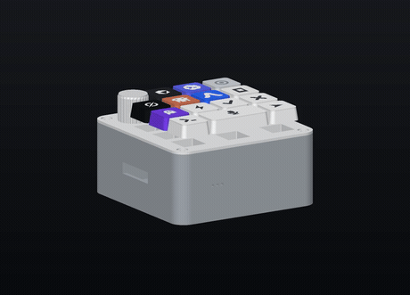
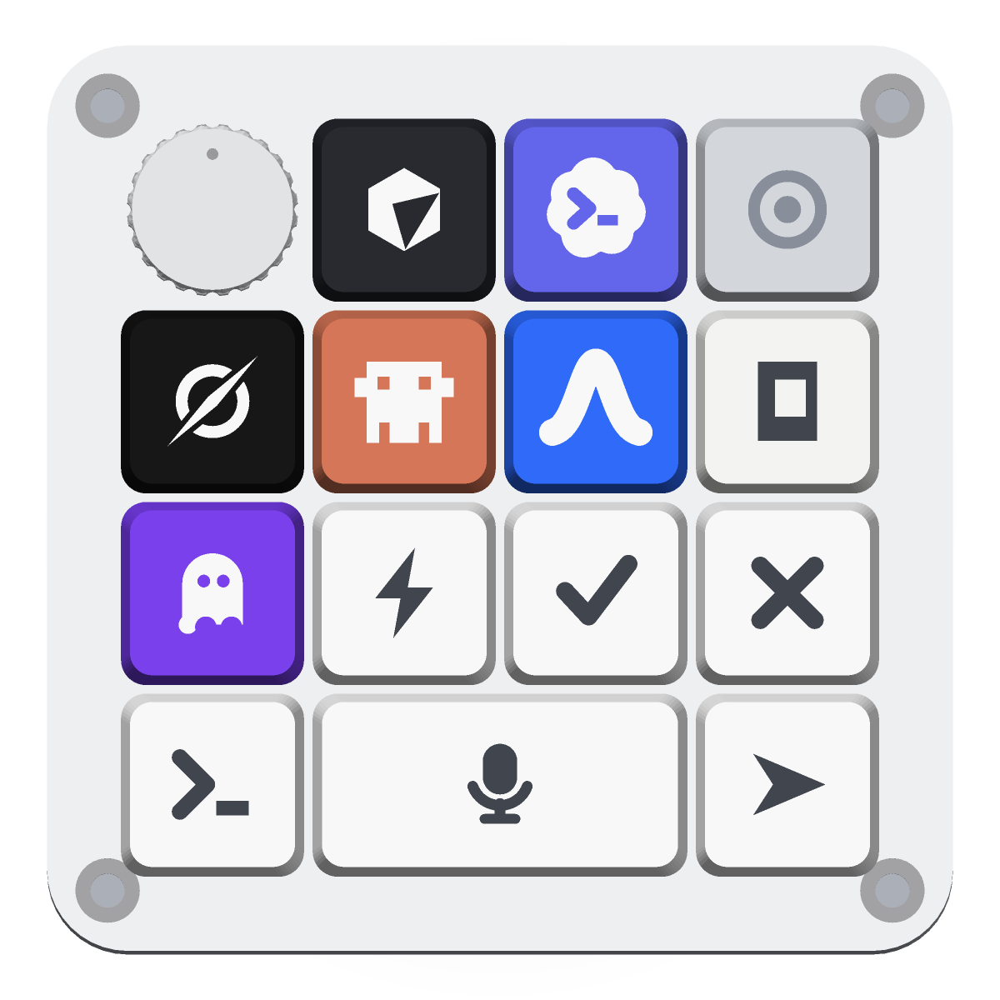

# The LoomPad (Orchestrator Pad)

<div align="center">


<sub>tray · switch deck · plate · keycaps · knob — <a href="docs/orchestrator-pad-reveal.mp4">watch the 15s MP4</a></sub>


</div>

A desk controller for Loom. Press a key to lock an agent, hold the bar and talk,
and hear the answer come back through the pad's own speaker. It talks to the
Loom daemon over Wi‑Fi, with USB‑HID as a fallback.

Everything here is remixable and MIT: the enclosure is parametric Python, the
agents on the keycaps are a table in [`cad/partlib.py`](cad/partlib.py), and the
whole thing prints on a bed‑slinger in an evening.

## The deck

<div align="center">

</div>

| | Key | What it does |
|---|---|---|
| 🎤 | **Voice bar (2u)** | hold to talk — audio streams to the daemon for speech‑to‑text |
| 🟧 | **Claude Code** | lock the baton to Claude Code |
| 🟣 | **Codex** | lock the baton to Codex |
| ⬜ | **OpenCode** | lock the baton to OpenCode |
| ⬛ | **Grok** | lock the baton to Grok |
| 🟦 | **Antigravity** | lock the baton to Antigravity |
| 🟪 | **Kiro** | lock the baton to Kiro |
| ⚡ | **Run** | kick off the queued job |
| ✓ / ✕ | **Approve / Reject** | answer the agent's next permission prompt from the pad |
| ⟩_ | **Prompt** | focus the target session's terminal |

Locking an agent is a real handoff — it moves the baton in Loom and shows up in
the thread like any other one.

## Print it

All five parts are watertight and print without supports. Sizes and triangle
counts are in [`exports/MANIFEST.json`](exports/MANIFEST.json).

| Part | File | Orientation |
|---|---|---|
| Tray | [`exports/tray.stl`](exports/tray.stl) | flat on the bed |
| Switch deck | [`exports/switch-deck.stl`](exports/switch-deck.stl) | flat, sits between tray and plate |
| Plate | [`exports/plate.stl`](exports/plate.stl) | top face down |
| Keycaps (all 14) | [`exports/caps-all.stl`](exports/caps-all.stl) | as oriented — slow the outer walls for crisp glyphs |
| Legends | [`exports/legends-all.stl`](exports/legends-all.stl) | two‑colour infills, print in the contrast colour |
| Knob | [`exports/knob.stl`](exports/knob.stl) | upright |

0.4 mm nozzle, 0.2 mm layers, PETG or PLA. Every part is a union of closed
shells, so slicers merge them on their own. If your printer runs tight, widen
the holes with the tolerance constants in [`SPEC.md`](SPEC.md) rather than
slicer XY compensation.

Prefer to look before you print — [`exports/orchestrator-pad-assembled.glb`](exports/orchestrator-pad-assembled.glb)
and [`exports/orchestrator-pad-exploded.glb`](exports/orchestrator-pad-exploded.glb)
open in any GLB viewer.

## Wire it

<div align="center">

</div>

An **ESP32‑S3‑DevKitC‑1** (N16R8 — 16 MB flash, 8 MB PSRAM). No diodes, no
potentiometer on this build. All grounds are common.

**Mic — INMP441 (I2S RX):** `VDD→3V3`, `GND→GND`, `L/R→GND`

| INMP441 | SCK | WS | SD |
|---|---|---|---|
| GPIO | **5** | **4** | **6** |

**Amp — MAX98357A (I2S TX):** `Vin→3V3`, `GND→GND`, `SD→3V3`

| MAX98357A | BCLK | LRC | DIN |
|---|---|---|---|
| GPIO | **15** | **16** | **7** |

**4×4 key matrix** — rows are `INPUT_PULLUP`, columns driven low one at a time:

| | Col0 · G14 | Col1 · G8 | Col2 · G17 | Col3 · G18 |
|---|---|---|---|---|
| **Row0 · G10** | **K1 mic** | K2 | K3 | — |
| **Row1 · G11** | K4 | K5 | K6 | K7 |
| **Row2 · G12** | K8 | K9 | K10 | K11 |
| **Row3 · G13** | K12 | K13 | K14 | — |

Status LED: the onboard WS2812 on **GPIO 48**, lit in the locked agent's colour.

Every pin lives in [`firmware/orchestrator_pad/config.h`](firmware/orchestrator_pad/config.h).

## Flash it

The sketch is [`firmware/orchestrator_pad/orchestrator_pad.ino`](firmware/orchestrator_pad/orchestrator_pad.ino)
— Arduino, ESP32‑S3. See [`firmware/README.md`](firmware/README.md) for the full
walkthrough.

You do not recompile to change networks. On first boot (or holding **K1** at
power‑on) the pad raises its own access point, **`LoomPad-Setup`**. Join it from
a phone, and a captive page lists nearby networks and asks for the backend URL
and a pad token. Save, and it joins your Wi‑Fi and keeps all of it in NVS.

Then it checks the backend's `/health` and asks it to speak "connected" through
the amp, so you know it is up without opening a terminal.

## How a job flows

```
hold 🎤 ──► ESP32-S3 streams mic audio ──► the daemon does speech-to-text
release ──► { agent: "claude-code", prompt: "..." }
press ➤ ──► the daemon routes the job to that agent's session
  ✓ / ✕ ──► answer the agent's next approval prompt from the pad
```

The pad stays dumb on purpose. It emits a small JSON protocol over WebSocket and
lets the daemon own speech‑to‑text, session routing and CLI orchestration. The
voice backend that pairs with it is in [`backend/`](backend/).

## Regenerate the CAD

The enclosure is code, not a binary — `numpy` and `shapely`, no CSG kernel.

```bash
python -m venv .venv && .venv/bin/pip install numpy shapely
cd cad && ../.venv/bin/python assembly.py
```

That rewrites every STL, both GLBs and the manifest.

| Path | What it is |
|---|---|
| [`SPEC.md`](SPEC.md) | the dimensional contract, all in mm |
| `cad/partlib.py` | the CAD kernel, plus the agent table on the keycaps |
| `cad/part_tray.py` | bottom shell: ESP32 rails, USB‑C slot, mic grille, bosses |
| `cad/part_plate.py` | top plate: 14 MX cutouts, knob hole, skirt, screw towers |
| `cad/part_caps.py` | 13× 1u caps and the 2u voice bar, debossed glyphs, MX stems |
| `cad/part_knob.py` | knurled dial knob, EC11 D‑shaft bore |
| `cad/assembly.py` | assembled and exploded GLB, print STLs, manifest |

## Bill of materials

- ESP32‑S3‑DevKitC‑1 (N16R8)
- 14× MX‑style switches
- INMP441 I2S microphone
- MAX98357A I2S amplifier + a small 4 Ω speaker
- EC11 rotary encoder (optional — the dial is in the CAD, not in this firmware)
- 4× M3 heat‑set inserts, 4× M3×10 button‑head screws

## Status

- [x] printable enclosure, caps and knob
- [x] wiring diagram and pin map
- [x] firmware — provisioning, matrix, hold‑to‑talk, spoken replies
- [x] voice backend
- [ ] effort dial in firmware (the knob prints, nothing reads it yet)
- [ ] PCB with hotswap sockets

PRs welcome. Measure twice, print once.
